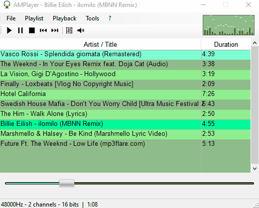

# ▶ AMPlayerDS 
AMPlayerDS is an audio player written entirely in **Visual Basic .NET** and based on the .NET Framework and WinForms

##### Decoding 
Various audio formats are supported in playback, including mp3, ogg, opus, wav, wma and compact disc:
- MP3 decoding is based on the open source library mpg123
- OGG decoding is based on the ogg and vorbis library
- WAV and CD decoding are written entirely in visual basic
- WMA,ACC (and possibly mp3, wav) decoding is based on the Media Foundation

##### Encoding
Support for transcoding input file types to mp3 (via lame encoder) or wav. Ability to rip CDs to mp3 or wav.
During encoding you can change the audio quality through the libsamplerate library.

##### Visualizations
Application of the Fast Fourier Transform in real time on the audio being reproduced for the graphic visualization of the frequencies

##### Playlists
Support for reading and writing playlists, m3u (probably in the future also .pls)

##### Realtime audio effects 
Ability to apply audio effects such as equalizer (Biquad filters) and Phase shift

##### Output
Audio output based on multi-threading stream on WaveOut or DirectSound API

##### File Associations
Manage windows file associations. It has a framework for managing single instances and communication between instances using the windows API.

##### Final thoughts 💥
This project was born as an attempt to understand the principle behind the operation of common audio players such as winamp, foobar, etc. written in a simple language such as VB.NET

Anyone can clone, modify and publish the repository, always citing the link of the original project. License GPL 3.00

## Compile ✔
Clone this repository and open with Visual Studio 2019. There is a Script in Project Configuration->Build->Build events to copy proper Platform DLL to output folder: for x64 build all DLL are compiled for x64 platform, while x86 for x86 platform.

❗ **X86 build option is necessary to edit AMPlayer form. Visual studio works on 32 bits(x86) and accepts only 32bits(x86) compiled custom controls** 

